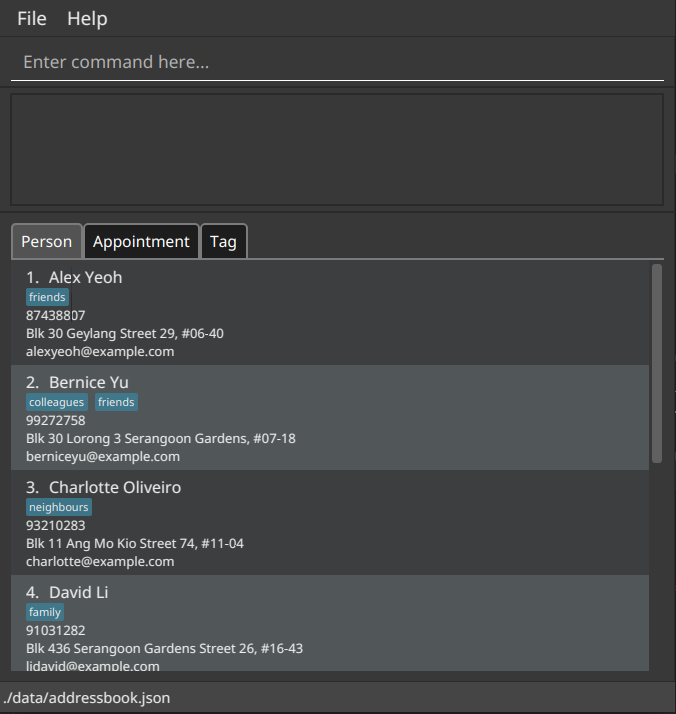
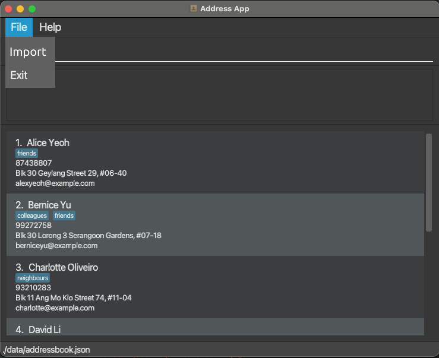

ContaX is a **desktop application for managing your Contacts and Schedule**. It is a powerful tool *optimized for use via a Command Line Interface* (CLI), while incorporating Graphical User Interface (GUI) elements to make it user-friendly. If you are able to type fast, ContaX is capable of helping you manage your contacts and schedule more efficiently than traditional GUI applications, allowing you to shift your focus to other things.

* Table of Contents
{:toc}

--------------------------------------------------------------------------------------------------------------------

## Quick start

1. Ensure you have Java `11` or above installed in your Computer.

1. Download the latest `addressbook.jar` from [here](https://github.com/se-edu/addressbook-level3/releases).

1. Copy the file to the folder you want to use as the _home folder_ for your AddressBook.

1. Double-click the file to start the app. The GUI similar to the below should appear in a few seconds. Note how the app contains some sample data. 
   

1. Type the command in the command box and press Enter to execute it. e.g. typing **`help`** and pressing Enter will open the help window. 
   Some example commands you can try:

   * **`list`** : Lists all contacts.

   * **`add`**`n/John Doe p/98765432 e/johnd@example.com a/John street, block 123, #01-01` : Adds a contact named `John Doe` to the Address Book.

   * **`delete`**`3` : Deletes the 3rd contact shown in the current list.

   * **`clear`** : Deletes all contacts.

   * **`exit`** : Exits the app.

1. Refer to the [Features](#features) below for details of each command.

--------------------------------------------------------------------------------------------------------------------

## Features

**:information_source: Notes about the command format:** 

* Words in `UPPER_CASE` are the parameters to be supplied by the user. 
  e.g. in `add n/NAME`, `NAME` is a parameter which can be used as `add n/John Doe`.

* Items in square brackets are optional. 
  e.g `n/NAME [t/TAG]` can be used as `n/John Doe t/friend` or as `n/John Doe`.

* Items with `…`​ after them can be used multiple times including zero times. 
  e.g. `[t/TAG]…​` can be used as ` ` (i.e. 0 times), `t/friend`, `t/friend t/family` etc.

* Parameters can be in any order. 
  e.g. if the command specifies `n/NAME p/PHONE_NUMBER`, `p/PHONE_NUMBER n/NAME` is also acceptable.

* If a parameter is expected only once in the command but you specified it multiple times, only the last occurrence of the parameter will be taken. 
  e.g. if you specify `p/12341234 p/56785678`, only `p/56785678` will be taken.

* Extraneous parameters for commands that do not take in parameters (such as `help`, `list`, `exit` and `clear`) will be ignored. 
  e.g. if the command specifies `help 123`, it will be interpreted as `help`.

### Viewing help : `help`

Shows a message explaning how to access the help page.

Format: `help`

### Adding a person: `add`

Adds a person to the address book.

Format: `add n/NAME p/PHONE_NUMBER e/EMAIL a/ADDRESS [t/TAG]…​`

:bulb: **Tip:**
A person can have any number of tags (including 0)

Examples:
* `add n/John Doe p/98765432 e/johnd@example.com a/John street, block 123, #01-01`
* `add n/Betsy Crowe t/friend e/betsycrowe@example.com a/Newgate Prison p/1234567 t/criminal`

### Listing all persons : `list`

Shows a list of all persons in the address book.

Format: `list`

### Editing a person : `edit`

Edits an existing person in the address book.

Format: `edit INDEX [n/NAME] [p/PHONE] [e/EMAIL] [a/ADDRESS] [t/TAG]…​`

* Edits the person at the specified `INDEX`. The index refers to the index number shown in the displayed person list. The index **must be a positive integer** 1, 2, 3, …​
* At least one of the optional fields must be provided.
* Existing values will be updated to the input values.
* When editing tags, the existing tags of the person will be removed i.e adding of tags is not cumulative.
* You can remove all the person’s tags by typing `t/` without
    specifying any tags after it.

Examples:
*  `edit 1 p/91234567 e/johndoe@example.com` Edits the phone number and email address of the 1st person to be `91234567` and `johndoe@example.com` respectively.
*  `edit 2 n/Betsy Crower t/` Edits the name of the 2nd person to be `Betsy Crower` and clears all existing tags.

### Locating persons by name: `find`

Finds persons whose names contain any of the given keywords.

Format: `find KEYWORD [MORE_KEYWORDS]`

* The search is case-insensitive. e.g `hans` will match `Hans`
* The order of the keywords does not matter. e.g. `Hans Bo` will match `Bo Hans`
* Only the name is searched.
* Only full words will be matched e.g. `Han` will not match `Hans`
* Persons matching at least one keyword will be returned (i.e. `OR` search).
  e.g. `Hans Bo` will return `Hans Gruber`, `Bo Yang`

Examples:
* `find John` returns `john` and `John Doe`
* `find alex david` returns `Alex Yeoh`, `David Li` 
  

### Deleting a person : `delete`

Deletes the specified person from the address book.

Format: `delete INDEX`

* Deletes the person at the specified `INDEX`.
* The index refers to the index number shown in the displayed person list.
* The index **must be a positive integer** 1, 2, 3, …​

Examples:
* `list` followed by `delete 2` deletes the 2nd person in the address book.
* `find Betsy` followed by `delete 1` deletes the 1st person in the results of the `find` command.

### Clearing all entries : `clear`

Clears all entries from the address book.

Format: `clear`

### Exiting the program : `exit`

Exits the program.

Format: `exit`

### Saving the data

ContaX data are saved in the hard disk automatically after any command that changes the data in JSON format at `[JAR file location]/data/contax.json`.

### Exporting the data: `exportcsv`

Exports the current list of contacts as a CSV file that can be imported through ContaX or other contact software such as Google/Outlook

Format: `exportcsv [EXPORTTYPE]`
* Exports CSV as per the specified format.
* If `EXPORTTYPE` is left empty, it will default to `EXPORTTYPE = 1` and export in custom ContaX format
* `EXPORTTYPE` options are
   * `EXPORTTYPE=1` for ContaX format
   * `EXPORTTYPE=2` for Google Contacts format
   * `EXPORTTYPE=3` for Microsoft Outlook format
* File will be saved on the directory `[JAR file location]/data/addressbook.csv`

Examples:
* `exportcsv 2`: Exports the current address book as a CSV file ready to be uploaded onto Google Contacts 
### Editing the data file

ContaX data are saved as a JSON file `[JAR file location]/data/contax.json`. Advanced users are welcome to update data directly by editing that data file.

:exclamation: **Caution:**
If your changes to the data file makes its format invalid, ContaX will discard all data and start with an empty data file at the next run.

### Importing data

In order to import data from external sources into ContaX, there are the following options:

* Replacing `contax.json` file with a valid ContaX formatted generated by another system with ContaX
* [Simple CSV import (GUI-based option)](#simple-csv-import)
* [Advanced CSV import (Command based)](#advanced-csv-import--importcsv)

### Simple CSV Import

Select the `Import` button under `File->Import` on the top bar.

Upon clicking, you will be prompted to select .csv or .json files. Accessing import via the top menu will allow users to import their task and appointments list as JSON/CSV files that were generated by another instance of ContaX.

### Advanced CSV Import : `importcsv`

Format: `importcsv [n/COLUMNNUM] [p/COLUMN_PERSON] [e/COLUMN_EMAIL] [a/COLUMN_ADDRESS] [t/COLUMN_TAGS]`

* Each argument represents the corresponding attribute for a person. 
  * n = Name
  * p = Phone
  * e = Email
  * a = Address
  * t = Tagged
* If any argument is omitted, it will follow the next available column based on the default sequence of
  Name - Phone - Email - Address - Tagged
* This user guide will be updated later on with templates for importing for the following contact csv formats:
  * Google Contacts
  * Outlook Contacts

Examples:
* `importcsv n/2 p/3 e/5 a/6 t/4`
  * Reads from a CSV file treating the 2nd row as names, 3rd row as phone numbers, 5th row as email addresses, 4th row as tagged.
* `importcsv n/2`
  * Reads from CSV treating the 2nd row as names, 3rd row as phone numbers, 4th row as email address, 5th row as tagged.

### Archiving data files `[coming in v2.0]`

_Details coming soon ..._

--------------------------------------------------------------------------------------------------------------------

## FAQ

**Q**: How do I transfer my data to another Computer? 
**A**: Install the app in the other computer and overwrite the empty data file it creates with the file that contains the data of your previous AddressBook home folder.

--------------------------------------------------------------------------------------------------------------------

## Command summary

Action | Format, Examples
--------|------------------
**Add** | `add n/NAME p/PHONE_NUMBER e/EMAIL a/ADDRESS [t/TAG]…​`   e.g., `add n/James Ho p/22224444 e/jamesho@example.com a/123, Clementi Rd, 1234665 t/friend t/colleague`
**Clear** | `clear`
**Delete** | `delete INDEX`  e.g., `delete 3`
**Edit** | `edit INDEX [n/NAME] [p/PHONE_NUMBER] [e/EMAIL] [a/ADDRESS] [t/TAG]…​`  e.g.,`edit 2 n/James Lee e/jameslee@example.com`
**Find** | `find KEYWORD [MORE_KEYWORDS]`  e.g., `find James Jake`
**List** | `list`
**Help** | `help`
**Export CSV** | `exportcsv [EXPORTTYPE]`  e.g., `exportcsv 2`
**Import CSV** | `importcsv [n/COLUMNNUM] [p/COLUMN_PERSON] [e/COLUMN_EMAIL] [a/COLUMN_ADDRESS] [t/COLUMN_TAGS]`   e.g., `importCSV n/2 p/3 e/5 a/6 t/4`
